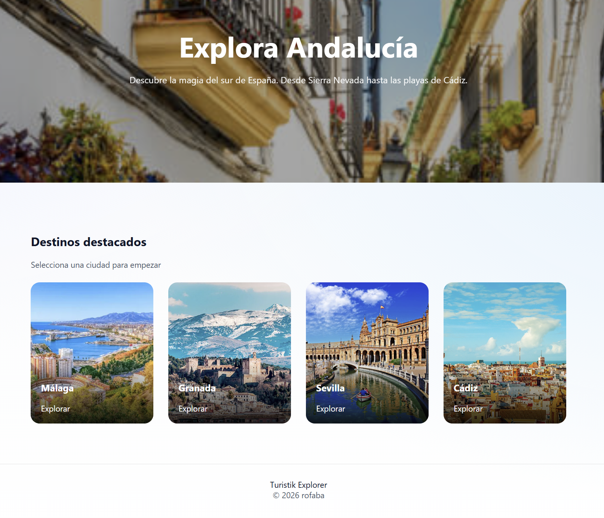
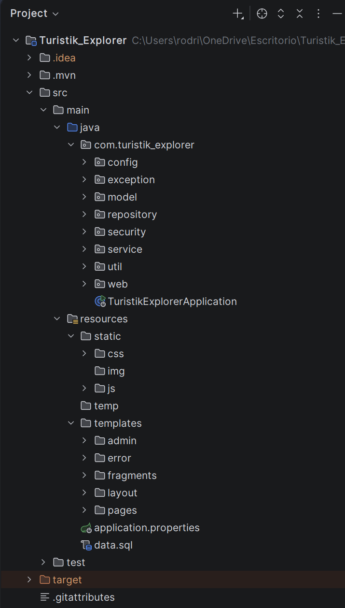
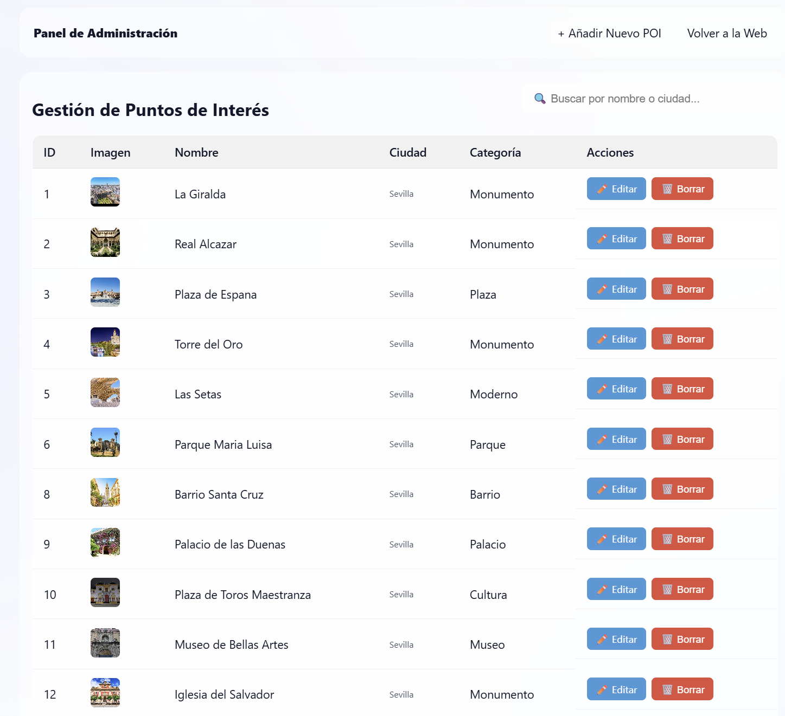
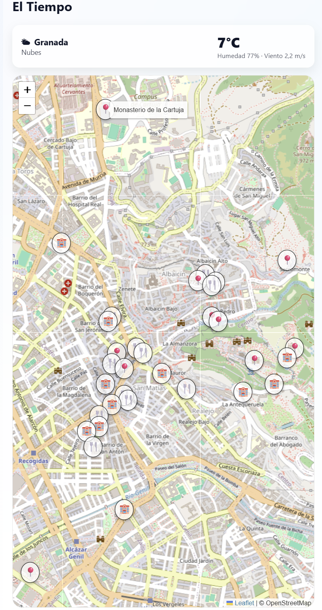
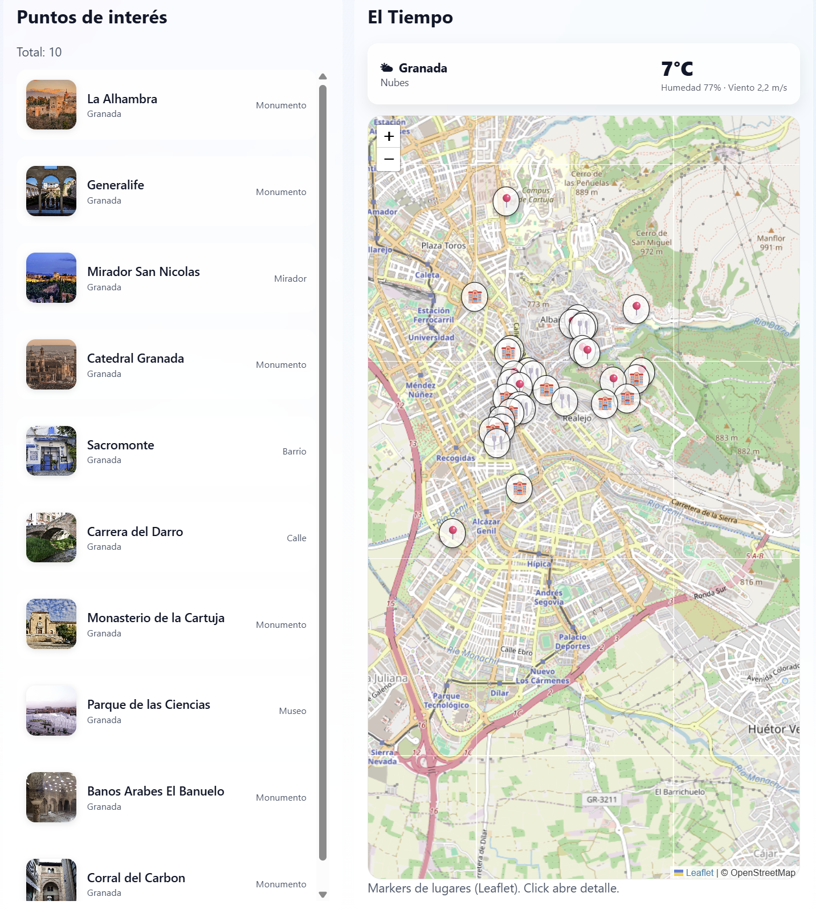
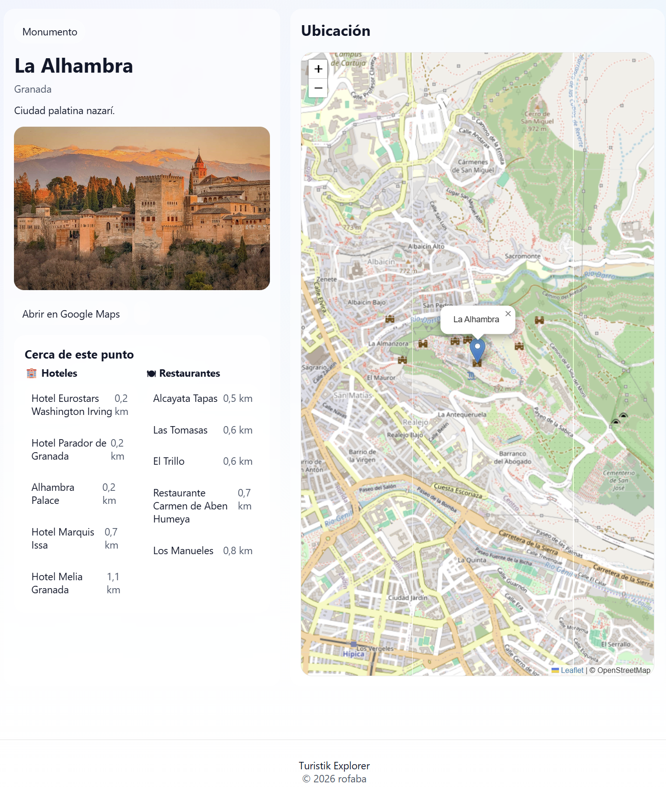

# 🌍 Turistik Explorer


Turistik Explorer es una aplicación web desarrollada con **Spring Boot** que permite explorar ciudades mostrando **puntos de interés, restaurantes y hoteles en un mapa interactivo**.

El objetivo del proyecto es ofrecer una forma sencilla de descubrir lugares de interés dentro de una ciudad, combinando una **lista de lugares con un mapa interactivo sincronizado**.

---

## ✨ Características

- 🔎 **Exploración de ciudades:** Filtra y descubre los mejores rincones.
- 🗺️ **Mapa interactivo:** Integración con **Leaflet** y OpenStreetMap.
- 📍 **Marcadores dinámicos para:** Puntos de interés (POIs), Restaurantes y Hoteles.
- 📋 **Listado de lugares:** Tarjetas visuales con diseño *Glassmorphism*.
- 🔐 **Panel de Administración (CRUD):** Autenticación de usuarios con **Spring Security** para gestionar los lugares.
- 🗄️ **Base de datos Dockerizada:** Despliegue rápido con PostgreSQL y carga automática de datos iniciales.

---

## 🖥️ Demo de la aplicación

Pantalla principal con lista de puntos de interés y mapa con marcadores sincronizados:



---

## 🛠️ Tecnologías utilizadas

**Backend:**
- Java 21
- Spring Boot 3
- Spring Security
- Spring Data JPA (Hibernate)

**Frontend:**
- Thymeleaf (Fragments)
- HTML5, CSS3, JavaScript puro
- Leaflet (Mapas)

**Infraestructura y Datos:**
- PostgreSQL
- Docker & Docker Compose

---

## 📂 Estructura del proyecto



---

## ⚙️ Instalación y Uso

### 📋 Requisitos Previos
Para levantar este proyecto en tu máquina local, necesitas tener instalado:
- [Java 21](https://jdk.java.net/21/)
- [Maven](https://maven.apache.org/)
- [Docker Desktop](https://www.docker.com/products/docker-desktop/) (o Docker Engine)

### 1️⃣ Clonar el repositorio
```bash
git clone [https://github.com/tuusuario/turistik-explorer.git]  
cd turistik-explorer

```

### 2️⃣ Levantar la Base de Datos (Docker)

El proyecto está configurado para levantar una instancia de PostgreSQL en un contenedor de Docker. Ejecuta el siguiente comando en la raíz del proyecto:

```bash
docker compose up -d

```

*💡 **Nota:** Gracias a la configuración de Spring Boot, al arrancar la aplicación se crearán las tablas y **se insertarán automáticamente los datos iniciales** de prueba (ciudades, POIs, etc.), por lo que no tienes que ejecutar ningún script manual.*

### 3️⃣ Ejecutar la aplicación

Una vez que el contenedor de la base de datos esté corriendo, arranca la aplicación de Spring Boot:

```bash
mvn spring-boot:run

```

*(O si usas el wrapper incluido: `./mvnw spring-boot:run`)*

### 4️⃣ Abrir en el navegador

Visita en tu navegador favorito:
👉 **http://localhost:8081** *(Ajusta al puerto disponible que utilices)*

---

## 🔐 Autenticación y Panel de Control

El sistema incluye una zona de administración protegida mediante **Spring Security** para realizar operaciones CRUD sobre los lugares.

**Credenciales de prueba por defecto:**

* **Usuario:** `admin`
* **Contraseña:** `admin123`
 


---

## 📍 Funcionalidades principales

### Mapa interactivo

Los lugares se muestran como **marcadores en el mapa**. Al hacer clic en ellos, se muestra un popup con la información básica y un enlace directo a la página de detalles completos.



### Tarjetas de lugares y Detalles

Las tarjetas tienen diseño interactivo.  
Al hacer clic, navegan a la página de detalle individual del lugar seleccionado.

 

---

## 🚀 Posibles mejoras futuras

* [ ] Filtros avanzados por tipo de lugar o categoría.
* [ ] Iconos personalizados en el mapa según el tipo (Hotel, Restaurante, Monumento).
* [ ] Implementación de un sistema de valoraciones (Estrellas / Reviews).
* [ ] Integración con APIs de clima o turismo externas.

---

## 👨‍💻 Autor

**Rodrigo Faure Bascur (rofaba)**

* GitHub: [@rofaba](https://github.com/rofaba)
* LinkedIn: [www.linkedin.com/in/
  rodrigofaure
](https://www.linkedin.com/in/rodrigofaure)
  ]

---

## 📄 Licencia

Este proyecto se distribuye bajo licencia [MIT](https://choosealicense.com/licenses/mit/).

```
¡Gracias por visitar el repositorio de Turistik Explorer!
Si tienes alguna pregunta o sugerencia, no dudes en abrir un issue o contactarme directamente.